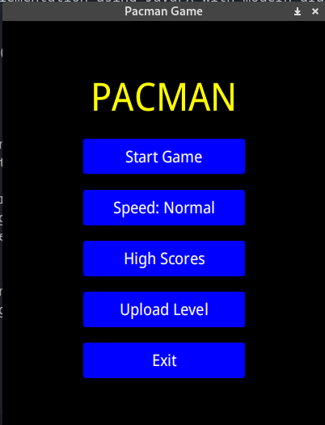
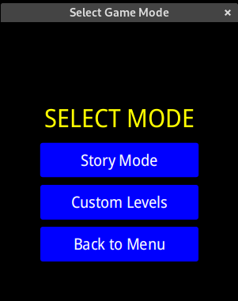
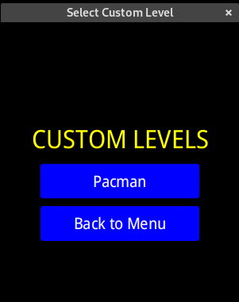
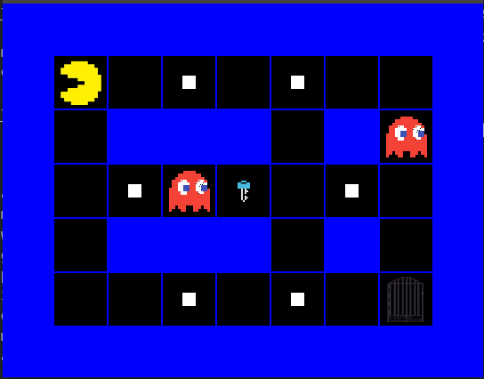
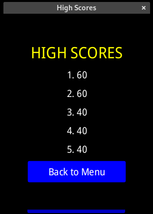

# Pacman JavaFX

A classic Pacman game implementation using JavaFX.

## Screenshots

<table>
  <tr>
    <td></td>
    <td></td>
    <td></td>
    <td></td>
    <td></td>
  </tr>
</table>

## Features

- Classic Pacman gameplay mechanics
- Smooth character movement using JavaFX animations
- AI-controlled ghosts with different behaviors
- High score system
- Custom level support through .txt files with:
  - First line specifies grid dimensions (rows columns)
  - Subsequent lines represent the game grid using:
    - `W` - Wall
    - `G` - Gate
    - `P` - Player starting position
    - `C` - Ghost starting position
    - `K` - Key
    - `o` - Dot (point)
  - Example level format:
    ```
    9 11
    WWWWWWWWWWW
    WP.o.o.o.CW
    W.WWWWW.W.W
    W.o.C.o.o.W
    W.W.WKW.W.W
    W.o.C.o.o.W
    W.WWWWW.W.W
    WC.o.o.o.GW
    WWWWWWWWWWW
    ```

## Installation

### Prerequisites
- Java JDK
- Maven

### Steps
1. Clone the repository:
   ```bash
   git clone https://github.com/arcamauro/pacman-javafx
   cd pacman-javafx
2. Run the game:
    ```bash
    mvn clean javafx:run
3. Enjoy with the different modes!
